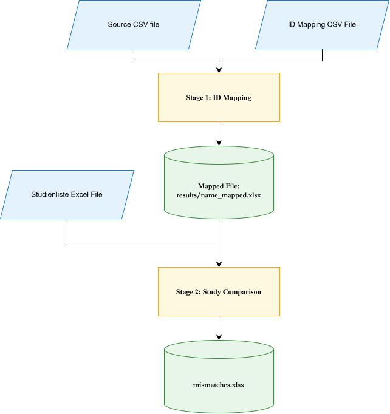

# Study Data Processing Pipeline 
A two-stage data processing pipeline for clinical study data management. The pipeline consists of two standalone Python applications that handle **ID-to-value mapping** and **comparison of study records between source files**. 

--- 

## Table of Contents 
- Overview
- Requirements
- Stage 1: ID Mapping Tool
- Stage 2: Study Comparison Tool
- Notes 

--- 

## Overview 
The pipeline is designed to process clinical study data through two sequential stages: 

- **ID Mapping (first_pipeline.py)**
Converts numeric IDs in a source CSV file into their corresponding human-readable values using a separate ID mapping file. 

- **Study Comparison (rostock_pipeline.py / greifswald_pipeline.py)** 
Compares records from a Studienliste Excel file against the mapped output from Stage 1 and generates a report of mismatches. 

### Pipeline Flow 


--- 

## Requirements 
- **Python Version**: Python 3.7 or higher 
- **Required Packages** : pandas, chardet, openpyxl, tkinter 

Install the required Python packages using: 
```bash
pip install pandas chardet openpyxl 
```
- **Note**: On some Linux distributions, tkinter may need to be installed separately using the system package manager.

--- 

## Stage 1: ID Mapping Tool (first_pipeline.py) 
## Purpose 
The ID Mapping Tool reads a source CSV file containing numeric ID references and replaces those IDs with their corresponding descriptive values.

The descriptive values are obtained from a separate ID mapping CSV file. 

## Supported Columns 
The following source columns are mapped using the corresponding category in the mapping file:

| Source Column | Mapping Category |
|---------------|------------------|
| orientation | Studienausrichtung |
| location | Standort |
| region | Region |
| organsystem | Organsystem |
| stadium | Stadium |
| phase | Phase |
| status | Studienstatus |
| styp | Studientyp |
| altersgruppe | Altersgruppe |
| therapielinie | Therapielinie | 

### Mapping File Format 
The ID mapping file must be a CSV file containing at least three columns:

| Column | Description |
|--------|-------------|
| Column 1 | Numeric ID |
| Column 2 | Descriptive value |
| Column 3 | Category name | 

The category name in the third column must exactly match one of the categories listed in the Supported Columns table. 

## Example

| ID | Value | Category |
|----|-------|----------|
| 1 | Interventional | Studienausrichtung |
| 2 | University Hospital | Standort |
| 3 | Oncology | Organsystem |

## Usage 
Run the script: 
```bash
python first_pipeline.py
```
A graphical interface will be displayed. 

## Steps
- Select the source CSV file using the **Source CSV File** browse button.
- Select the ID mapping CSV file using the **ID Mapping File** browse button.
- Click **Start Processing**.
- Wait for the processing to complete. 

## Output 
The output is saved in a results subfolder in the same directory as the script.

The output filename follows this format:
```bash
results/<source_filename>_mapped.xlsx 
```

**For example**: 
```bash
results/studies_mapped.xlsx
```

## Features
- Automatic encoding detection using chardet.
- Fallback support for common encodings:
    1. UTF-8
    2. Latin-1
    3. CP1252
    4. ISO-8859-1
- Removal of illegal characters that Excel cannot handle.
- Automatic conversion of the mapped CSV to Excel format.
- Fallback to CSV output if Excel export fails.
- Progress bar and status messages.
- Processing runs in a separate thread to keep the graphical interface responsive.
- Original input files are not modified. 

--- 

## Stage 2: Study Comparison Tool (rostock_pipeline.py / greifswald.py) 
## Purpose 
The Study Comparison Tool compares study records from a Studienliste Excel file against the mapped output produced by Stage 1.

The tool identifies discrepancies between the two data sources and generates a mismatch report. 

## Input Files 
- Studienliste Excel File 
An Excel workbook containing a sheet named: **Studienliste**

- Mapped File 
The mapped output generated by Stage 1.

The tool supports: **Excel (.xlsx)** and **CSV (.csv)**

## Column Mappings 
The comparison uses the following mappings: 
| Studienliste Column | Mapped File Column |
|---------------------|--------------------|
| Standort | location |
| Studientitel deutsch / Studientitel | title |
| Acronym | acronym |
| EU-CT No | ref_id |
| Registrierungs-nummer DRKS | drks_id |
| Registrierungsnummer Clinical trials gov | nct_id |
| Erkrankung vereinfacht | organsystem |
| Art der Intervention und Stadium | stadium |
| Phase | phase |
| Rekrutierungsstatus | status |
| IIT / UMR-initiiert | styp |
| durchführende Einheit | department |
| PI UMR | controller |
| Altersgruppe | altersgruppe |
| Therapielinie | therapielinie | 

#### Value Normalization 
Before comparing values, the tool applies normalization rules to reduce false mismatches. 

#### Specific Value Mappings
Additional normalization is applied to specific fields.
- **Status**: English recruitment status values are translated to their corresponding German equivalents before comparison. 
- **Location**: Different spellings or representations of the same institution are normalized to a canonical location value. 
- **Phase**: Phase names are simplified to standardized representations. 
- **Altersgruppe**: Age ranges are mapped to their corresponding descriptive categories.
- **Studientyp (styp)**: The study type is calculated from the IIT and UMR-initiiert columns, taking the region into account. 

----

## Matching Logic 
Study records are primarily matched using the Acronym field.

### Step 1: Acronym Matching
The acronym is compared case-insensitively. 
```bash
   ABC-123
   abc-123
   ```
are therefore treated as the same acronym. 

### Step 2: Location Disambiguation 
If multiple records have the same acronym, the tool attempts to distinguish them using the Standort / location field.

### Step 3: Fallback Matching 
If no matching location is found among duplicate acronyms, the first matching record is used.

### Output 
The comparison generates: **mismatches.xlsx** 

The file is saved in the same directory as rostock_pipeline.py / griefswald.py. 

### Output Columns

| Column | Description |
|---|---|
| `acronym` | Study acronym |
| `column` | Column where the mismatch was found |
| `wrong_value` | Value found in the mapped file |
| `corrected_value` | Expected value from the Studienliste |
| `issue` | Description of the issue, when a record is not found | 

### Example

| acronym | column | wrong_value | corrected_value | issue |
|---|---|---|---|---|
| ABC123 | phase | II | I | |
| XYZ456 | status | Recruiting | Rekrutierend | |
| TEST01 | acronym | | | Record not found |

### Usage 
Run the script: 
```bash
    python rostock_pipeline.py or python griefswald_pipeline.py
 ```
 A graphical interface will be displayed.

### Steps
- Select the **Studienliste Excel file**.
- Select the **mapped file** generated by Stage 1.
- Click **Start Comparison**.
- Wait for the comparison to finish.
- Review the generated **mismatches.xlsx** file. 

### Output Location 
```bash
    mismatches.xlsx
 ``` 
The report is saved in the same directory as the script. 

### Features
- Supports Excel and CSV input for the mapped file.
- Automatic encoding detection for CSV files.
- Case-insensitive comparison.
- Field-specific value normalization.
- Duplicate acronym handling using location matching.
- Processing runs in a separate thread to keep the interface responsive.
- Detailed console output for debugging and traceability.
- Generates a structured mismatch report.
- Original input files are not modified.

## Notes 
The ID mapping tool expects the mapping file to contain a category column that exactly matches the category names listed in the Supported Columns table.

The Studienliste worksheet name must be exactly: **Studienliste** 

- Acronyms are used as the primary record-matching key.
- Duplicate acronyms are disambiguated using the location where possible.
- The pipeline does not modify the original input files.
- Stage 2 should normally be run using the mapped output generated by Stage 1.
- The generated mismatches.xlsx file contains only the discrepancies identified during comparison.

### Quick Start 
Install the dependencies: 
```bash
    pip install pandas chardet openpyxl
``` 

Run Stage 1: 
```bash
    python first_pipeline.py
```  

Then run Stage 2: 
For specific location, that is 'Rostock' or 'Greifswald' run the specific command 
```bash
    python rostock_pipeline.py or python griefswald_pipeline.py 
```  

Finally, review: 
```bash
    mismatches.xlsx
```  
The two applications are standalone tools, but together they form the complete study data processing pipeline.